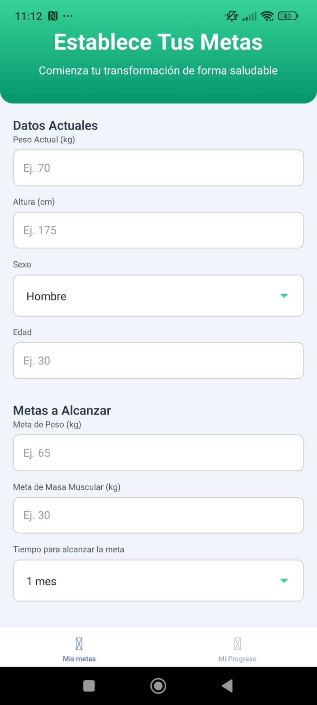

# FitNote – Monitor de Progreso Físico y Corporal 💪📈

FitNote es una app desarrollada con **React Native** y **Expo** para llevar un registro personalizado de tu progreso físico y corporal. Permite guardar y visualizar de manera semanal datos clave como:

- Peso corporal
- Altura
- IMC (Índice de Masa Corporal)
- Masa muscular

Con gráficos evolutivos y metas personalizadas, FitNote te motiva a mantener un seguimiento realista y visual de tu avance en el tiempo.

## ✨ Funcionalidades

- Registro de datos corporales semanales
- Cálculo automático de IMC
- Visualización gráfica del progreso
- Comparación con metas establecidas
- Autenticación con cuenta de Google
- Base de datos conectada con **Supabase**
## 🎞️ Imagenes del proyecto
### Autenticación con Google

### Registro de datos semanales

  

### Gráficos evolutivos

  

